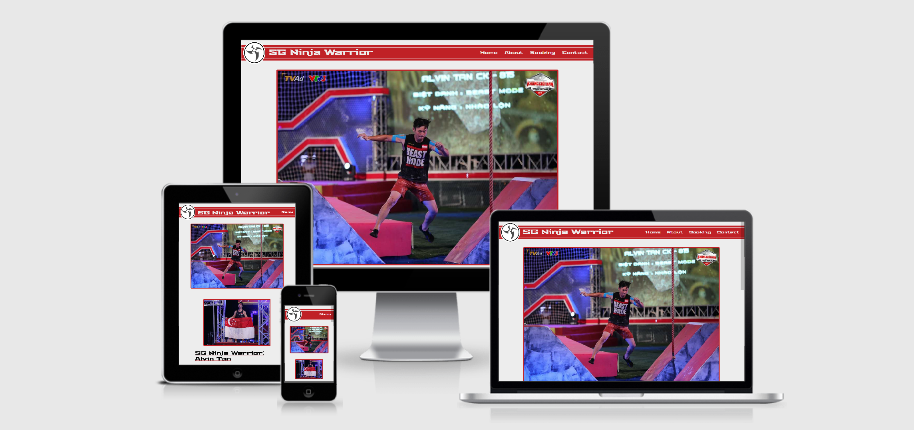
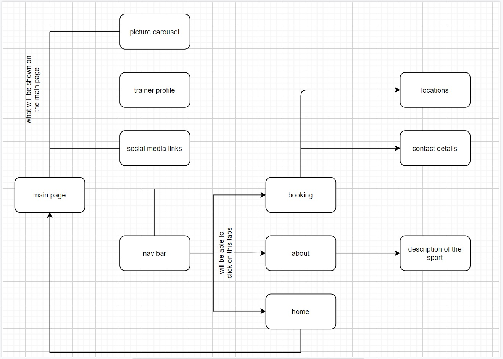
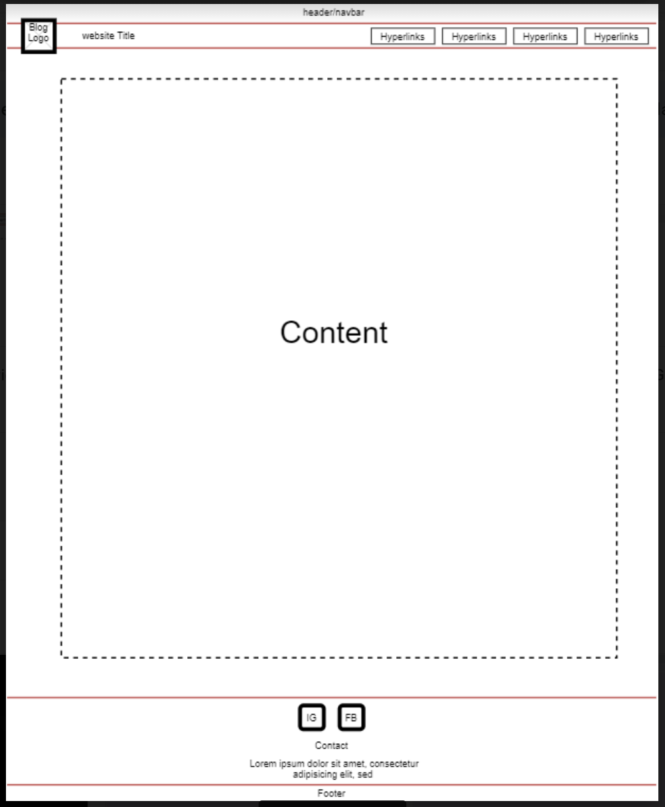

# TGC-frontEnd-assignment1
# First assignment with front end using programming language  such as HTML, CSS and Javascript.
OBJECTIVE
In Assignment 1, we will be tasked to create a website with interactive elements (implemented
with JavaScript), while also demonstrating understanding of the Five Planes of UI/UX.

The five Planes of UI/UX will be based on:

* Strategy
* Scope
* Structure
* Skeleton
* Surface

# Strategy
Primarily a website to target fitness and people who are interested in the sport. Will also use as a platform to promote the sport in Singapore and to gain awareness.
Allowing user to have a chance to experience the obstacles and the training process.

## User's goals
The purpose of this website will be to promote the sport and allow the public to have a chance to experience the sport with class bookings and a brief information of the sport and its origins.
Ninja warrior is not common in Singapore and I hope with the help of this website, it will be able to gain more awareness and interest from the public. If by any chance any sponsors chanced upon the website, I hope it will spark their interest and provide sponsorship to the coach featured on the website.

Some goals that the user might want to optain from the website or certain features that user will be interested in are:
* What is the website about?
* who is the website talking about?
* what is Ninja Warrior?
* If I am interested to know more, how can I go about to make a class booking or contact. 
* location of the outdoor training.

## Site owner's goals
The goal of creating this website is to get more people to know about the existance of the sports in Singapore and to promote the training the coach is giving. 

Being in a sport where there are not much recognition in the world or knowledge about it. It is tough to gain popularity and the trust of the public to participate in the activities. With no proper training facilities training centres in Singapore, I would like to let the users know that training can be done anywhere in Singapore as long as we practice it safetly and under the guidance of the coach.
The site should served this purpose to the user:
* Easy to navigate.
* Clear and easy to understand informations
* Contact details of the coach.
* Achievement of the coach.

## User Stories
As a user, this are the few things I hope to achieve when I visit the website:
* Able to know what is the website about.
* Who is the website promoting?
* Is the coach or person on the website experienced?
* If I am interested, how can I contact the coach?

# Scope
## Functional
Through the site, user will be able to have information on the sport and be able to book for training classes from the website. 
## Content
With the help of simple picture illustrations and simple write out. User will have a quick and brief idea of the sport and the coach of the site. 
Upon coming to the website, the user may want to understand more about the sport and where are the venues to tryout.

Some Mandatory requirements will include:
* Brief information of the sport.
* Brief information of the coach.
* The coach experience and qualifications.
* Contact details of the coach.
* Booking and locations of the training value.

## Content requirements
### The following will be added into the content of the website.
* Description of the sport.
* Description of the coach.
* Qualifications and experience of the coach.
* Booking and locations of training venues.

# Structure
Structure of the site will be very straightforward and simple for easy navigation. The hyperlinks will be clearly indicated and the site will be clearly segmented for easy navigation.
Booking of classes will be a fuss free and easy process, with the user choosing a location of choice and subsequently the timing available for the class.
Structure of the page shall be a tree. As a tree structure provide simple and easy navigation and clear direction of the page layout.

Upon entering the site, user will be greeted with the main page with three different segments and a nav bar at the top of the page.
The main hyperlinks will be located on the nav bar and there will be social media links at the bottom of the page.

## Content Structure

### Home
* The home page will have a carousel from Bootstrap 4. In the carousel will be competitions image of the coach.
* It allows visitor a visual understanding of who the website is promoting and the obstacles of the sport.
* There will also be competitions achievement from the coach previous competitions competed.

### About 
* At the 'About' page, we will be greeted with three sections. 
    * Descriptioon of the Sport, Ninja Warrior.
    * Description of the coach, Alvin Tan.
    * Pictures of the coach qualifications. 

### Booking
* In the Booking page, we will be greeted with a Leaflet Map with markers. 
    * The markers will correspond to the outdoor training locations and the timing. 
    * Each marker will be attached with a booking button for the user to make a booking and thus be directed to the bottom of the page to enter their details. 

### Contact
* If the user wish to know more details of the sport or the coach, there is a tab labelled "Contact"
* Upon clicking it, it will direct the user to the contact details of the coach and his social media profile.

## Interaction design

### Consistency
* The fonts in the website is kept the same amoung all the pages and the hyperlinks tab will be highlighted in blue to indicate it is a clickable item.

### Predictable 
* To clearly indicate what the each hyperlink tab are being directed to. The hyperlinks are named with clear understanding of the page that will be directed to. 

# Skeleton
The skeleton of the page will be straight forward and simple.

Each page will consists of this three main components:
* Navbar
* Body/Content
* Footer

Navbar and footer will be the same and positioned the same in all the pages to create consistency. 
Navbar will consists of the logo and the name of the website together with the hyperlink tabs.
Footer will include the links to the coach social media pages.

## Navigation design

### Navbar
* The Logo will be original image from the coach and will be place beside the website header. 
* The Navbar will be made with CSS Flexbox.
* The Navbar will be mobile responsive and the hyperlink tabs will be minimised in to a 'Menu' button for smaller screen size. 

### About page
* In the 'About' page, the content will be divided into three sections. The first two sections wil consists of pictures and descriptions.
* In the third section, there will be a display of certificates obtain by the coach. 

### Booking page
* Under the 'Booking' page, with the help of Leaflet Map API, location markers will be placed on the map for a interactive location selection design interface. 
* Upon clicking the markers, user will be redirected to the contact section where the location they have choosen will be remembered. 

# Surface (Design Interface)

## Color
After doing research and visiting several similiar websites. The theme for the site has been decided:
* Red 
* Black 
* white 

The considerations for the colors comes from the logo of the sport and to create a striking and impactful impression to the user.

## Fonts
Font chosen for the website is: [Stalinist One](https://fonts.google.com/specimen/Stalinist+One)

Although it is an unconventional font to use but after some consideration, I think the font dicpicts nicely the spirit of a Ninja and the advanturer spirit in the sport. 

## Image 
All pictures image used are directly sourced from the coach himself with his approval for usage.
The logos found on the 'About' page were sourced from google image search. 

# Construction of the website 
The following list of technologies were use to construct the website:
* HTML5
    * To create the basic structure of all the pages and for adding content informations.
* CSS3
    * To create styling for the structure of the page and design layout. 
* JavaScript
    * To create more responsive user interactions and the use of Leaflet Map API. 
* Bootstrap
    * To create the carousel.
* GitHub 
    * To create a respository for the project and a saving backup option.
* Gitpod
    * Online IDE for the use of all the coding activities.
* Structure Diagrams 
    * Use it for the drawing of the structure of the website.
    * [Draw IO](https://www.draw.io)
* Dirty Markup
    * A website to format the code.
    * [Dirty Markup](https://www.10bestdesign.com/dirtymarkup/)
* Microsoft Paint
    * For simple picture editing.
* Responsive Web Design Checker 
    * For checking of the website on different platform e.g mobile and tablet
    * [Responsive Web Design Checker](https://responsivedesignchecker.com/) 

# Credits

## Image 
All photos from the website were contributed from the coach himself. 

All pictures and logos from the website were searched and sourced from google image.

## Content
All Content and information on the website are contributed by the coach himself.

## Guidance 
Mr Paul Chor 
* Mentor of the course. 

Mr Shun Ng
* TA of the course.

Batchmates of Trent global College: Diploma in Software Development.
